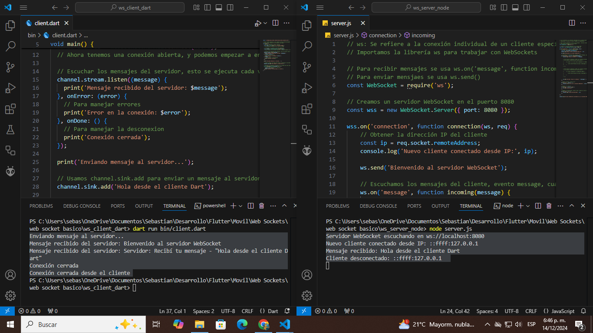

# 🚀 Dart WebSocket Client-Server Project

[](https://flutter.dev)

[](LICENSE)



## 📚 Descripción

Este proyecto tiene como objetivo la implementación de un sistema de comunicación bidireccional en tiempo real entre un servidor y un cliente utilizando WebSockets. El servidor está desarrollado en **Node.js** utilizando la librería `ws`, y el cliente está desarrollado en **Dart** utilizando el paquete `web_socket_channel`.

## 🎯 Objetivo del Proyecto

- Comprender cómo funcionan las conexiones WebSocket con Dart para luego implementarlo en Flutter.
- Implementar un servidor WebSocket en Node.js.
- Crear un cliente WebSocket en Dart.
- Practicar la comunicación en tiempo real entre servidor y cliente.

## 🛠️ Características

- **Servidor WebSocket en Node.js**: Usando la librería `ws` para manejar las conexiones.
- **Cliente WebSocket en Dart**: Usando el paquete `web_socket_channel` para la comunicación.
- **Mensajes bidireccionales**: Envío y recepción de mensajes entre cliente y servidor.
- **Conexiones simultáneas**: El servidor puede manejar múltiples conexiones al mismo tiempo.

## 📂 Estructura del Proyecto

### Dart
```plaintext
bin/
├── client.dart        # Código del cliente Dart
```

### NodeJs
```plaintext
server.js              # Código del servidor WebSocket
```

## 🚀 Cómo Ejecutar el Proyecto

### Servidor
1. Asegúrate de tener Node.js instalado. Si no, sigue las instrucciones en la [documentación oficial](https://nodejs.org/en).

2. Clona este repositorio:

```bash
git clone https://github.com/DevmenteSac/dart_websocket
```

3. Navega al directorio del servidor:

```bash
cd ws_server_node
```

4. Instala las dependencias:

```bash
npm install
```

5. Ejecuta el servidor:

```bash
node server.js
```

### Cliente
1. Asegúrate de tener Dart instalado.

2. Navega al directorio del cliente:

```bash
cd ws_client_dart
```

3. Instala las dependencias:

```bash
dart pub get
```

5. Ejecuta el cliente:

```bash
dart run bin/client.dart
```

## 🧰 Herramientas Usadas

- **Node.js**: Entorno de ejecución JavaScript para el servidor.
- **ws**: Librería para WebSockets en Node.js.
- **Dart**: Lenguaje de programación para el cliente.
- **web_socket_channel**: Paquete de Dart para la comunicación WebSocket.
- **VS Code**: Entorno de Desarrollo.


## 📖 Lo que He Aprendido

- 🌟 Cómo establecer una conexión WebSocket desde un cliente en Dart hacia un servidor en Node.js.
- 🌟 Cómo manejar la recepción y envío de mensajes a través de WebSockets.
- 🌟 Cómo gestionar múltiples conexiones de clientes en el servidor.

## 📋 Próximos Pasos

- Mejorar el manejo de errores en el servidor y cliente.
- Implementar reconexiones automáticas en caso de desconexión.
- Implementar pruebas unitarias y de integración.

## 🤝 Contribuciones

Este proyecto es principalmente para aprendizaje personal, pero siéntete libre de proponer mejoras o sugerencias.

## 📞 Contacto
Bastian Naitsab - [devmentesacontacto@gmail.com](mailto:devmentesacontacto@gmail.com)  
GitHub: [DevmenteSac](https://github.com/DevmenteSac)